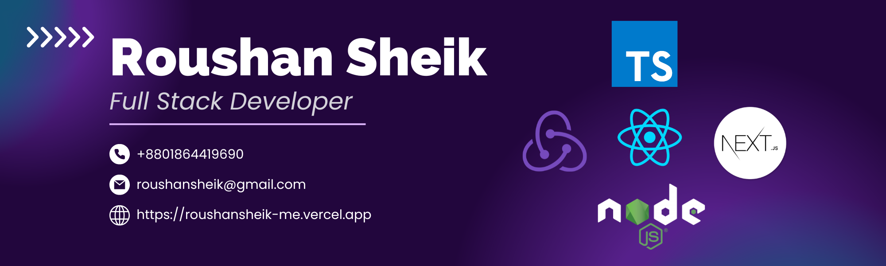
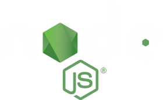
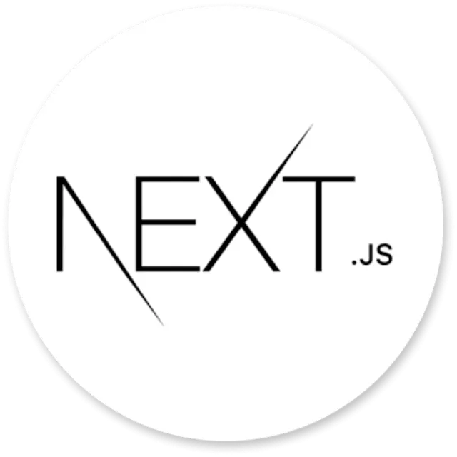

<!-- ### Hi there 👋  -->

 

<!-- Contact Me  -->

## ⚡ Technologies I work with

<table>
  <tr>
    <td align="center" width="96">
      
       TypeScript
    </td>
       <td align="center" width="96">
      
       TailwindCSS
    </td>
    <td align="center" width="96">
      
       React JS
    </td>
    <td align="center" width="96">
      
       Redux
    </td>
    <td align="center" width="96">
      
       Node JS
    </td>
    <td align="center" width="96">
      
       Next JS
    </td>
    <td align="center" width="96">
      
       Prisma
    </td>
        <td align="center" width="96"> 
      
       PostgreSQL
    </td>
    <td align="center" width="96"> 
      
       MongoDB
    </td>

  </tr>
</table> 
<!-- description  -->
<h2>Full Stack Expertise</h2>

I'm a Full-Stack Developer, creating responsive web applications with React.js, Next.Js, Node.js, Prisma , PostgreSQL and MongoDB. I prioritize clean, efficient code and constantly sharpen my skills in modern web technologies.

<!-- contact info  -->
<h2 style="margin: 25px 0px;color:#00dfa2;">Where to find me</h2>

<h2 align="left">🚀Coding Activity</h2

<!-- Add:============ New -->
 
<a >

  

    
    
  
</a>
  

 

  

<!-- Add:============ -->

<!--
